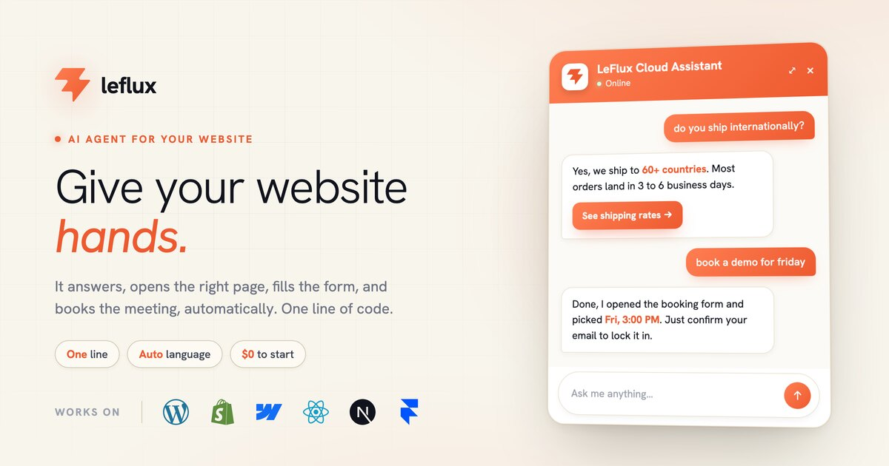

<p align="center">
  
</p>

<h1 align="center">LeFlux Docs</h1>

<p align="center">
  <strong>Give your website hands.</strong><br>
  An AI agent for any website, not just a chatbot. It answers your visitors, opens the right page, fills the form, and books the meeting, automatically. One line of code.
</p>

<p align="center">
  <a href="https://leflux.xrlabs.app">Website</a> ·
  <a href="https://leflux.xrlabs.app/docs">Documentation</a> ·
  <a href="https://github.com/PocketSystems/leflux-docs/issues">Report an issue</a>
</p>

<p align="center">
  
  
  
</p>

---

## What is LeFlux?

LeFlux is a JavaScript widget you drop onto any website. Visitors chat in natural language, and the agent actually does the work: it reads the page, navigates to where the answer lives, fills forms, opens modals, and answers from a knowledge base built by crawling your site.

Not a chatbot that replies. An AI agent that acts.

```html
<script src="https://leflux.xrlabs.app/embed.js" async></script>
```

That is the whole integration. No tokens, no keys, no config. The script auto-detects your site, fetches your per-tenant config, and mounts in a shadow DOM so it never collides with your CSS.

## Works on every platform

Same one line, whatever you built with.


Plus any custom stack. There is an install guide for each in the [docs](https://leflux.xrlabs.app/docs).

## What it does

- **Universal indexing** so the agent references elements by id, not brittle CSS selectors, and works on any site.
- **Knowledge base** built by a crawler that walks your site, so answers come from your content first.
- **Action execution** for click, type, scroll, navigate, and select, composed into multi-step workflows.
- **Form auto-fill** that asks for missing values one at a time, then fills and submits in one atomic step.
- **Multi-language** detection every message, mirroring the visitor's language.
- **Three layouts**: floating bubble, bottom-bar pill, and dockable side panel.

## This repository

This is the source for the LeFlux documentation site, served live at **[leflux.xrlabs.app/docs](https://leflux.xrlabs.app/docs)**. It is built with [Astro Starlight](https://starlight.astro.build).

### Local development

```bash
cd docs-site
npm install
npm run dev
```

The docs build and deploy automatically on every push to `main`.

## Found a bug or have a feature request?

Please open it here: **[github.com/PocketSystems/leflux-docs/issues](https://github.com/PocketSystems/leflux-docs/issues)**

That is the right place for anything LeFlux related: docs fixes, widget bugs, integration questions, or feature ideas. We read every one.

---

<p align="center">
  <a href="https://leflux.xrlabs.app">leflux.xrlabs.app</a>
</p>
